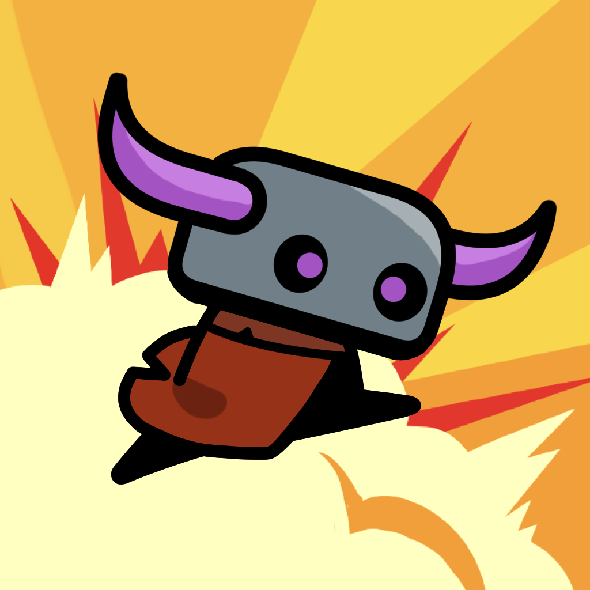
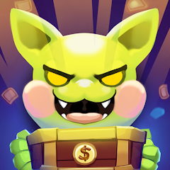

# Profile

## 보유 기술
C#(닷넷코어), AWS, 유니티, GoLang

 
 
 

## 극한직업 용사의 매니저 (라이브 중, 중도 참여)
### 사용기술

#### 자바스크립트
- node.js

#### AWS
- Lambda
- API Gateway
- Route53
- RDS
- S3
- CloudWatch

#### 작업 내용
- 모놀리식으로 운영되던 서버를 AWS의 Lambda에 MSA로 서비스되게 변경. 코드 관리 및 배포의 용이성 증가.
- Lambda에 개별 파일을 통해 배포.
- CloudWatch 경보를 통해 RDS 인스턴스의 CPU 사용률이 급격히 높아질 경우 메일로 알림을 보냄.
- 기존 ELB에 백업되던 유저들의 데이터를 S3로 마이그레이션.

 
 
 

## 몬스터 대마왕 1호점 (서비스 종료)

### 사용기술

#### 자바스크립트
- node.js

#### AWS
- Lambda
- API Gateway
- Route53
- RDS
- S3
- DynamoDB

#### RDB(MySQL)
- 회원가입 및 로그인 기능 구현
- 밴 기능 구현
- 이벤트 기능 구현
- 우편 기능 구현
- 버전 체크 기능 구현

#### NoSQL(DynamoDB)
- DynamoDB에 로깅.

#### 작업 내용
- Lambda에 개별 파일을 통해 배포.
- 구글, 애플의 API를 통한 구매 영수증 검증.
- S3에 유저들의 데이터 백업.

 
 
 

## 마계전자 (라이브 중)

### 사용기술

#### 자바스크립트
- node.js
    - socket.io

#### AWS
- Lambda
- API Gateway
- Route53
- RDS
- S3
- ElasticBeanstalk
- CloudWatch
- Redis
- DynamoDB

#### RDB(MySQL)
- 회원가입 및 로그인 기능 구현
- 밴 기능 구현
- 이벤트 기능 구현
- 우편 기능 구현
- pvp 기능 구현
- 핫타임 기능 구현
- 시즌 별 보스 도전 컨텐츠 구현(자동 교체 포함)
- 길드 기능 구현
- 공지사항 기능 구현
- 세션 기능 구현
- 버전 체크 기능 구현
- 시즌 기능 구현(시즌에 맞춰 해당하는 패키지를 판매)
- pvp 히스토리 기능 구현

#### 유니티
- 채팅 모듈

#### 웹
- 부트스트랩
- socket.io

#### 작업 내용
- Lambda에 개별 파일을 통해 배포.
- 구글, 애플의 API를 통한 구매 영수증 검증.
- S3에 유저들의 데이터 백업.
- CloudWatch 경보를 통해 RDS 인스턴스의 CPU 사용률이 급격히 높아질 경우 메일로 알림을 보냄.
- node.js로 채팅 서버를 구현. 각 언어에 맞게 채널을 구분.
- Redis를 통해 채팅 메시지를 임시로 저장하고 있다가 정해진 시간마다 S3에 백업.
- Redis를 통해 랭킹 컨텐츠의 순위를 저장.
- 유니티에 채팅 모듈을 구현함. UI를 통해 채팅 메시지를 띄우고, 채팅 메시지의 특정 부분 클릭 시 커스텀 태그 기능이 작동하도록 구현.
- 웹으로 어드민 페이지를 구현하여 채팅 메시지를 확인하고 유저 밴 처리와 우편 보내기 기능을 구현.
- DynamoDB에 서버 로깅.
- CloudWatch 이벤트를 통해 cron 시스템을 구현. 일정 기간마다 랭킹전 컨텐츠의 보스가 교체되도록 함.
- 길드 시스템 구현.
- 일일, 주간, 시즌 보상 자동 지급 시스템 구현.
- 아이템 지급 이벤트 시스템 구현.

 
 
 

## 머지 드릴 (서비스 종료), 리버스 드라이브 (서비스 종료), 니트로 점프 (서비스 종료)

### 사용기술

#### 자바스크립트
- node.js

#### AWS
- Lambda
- API Gateway
- Route53
- RDS
- S3

#### 유니티

#### 작업 내용
- Lambda에 개별 파일을 통해 배포.
- 구글, 애플의 API를 통한 구매 영수증 검증.
- S3에 유저들의 데이터 백업.
- 자사의 광고영상을 다운로드하여 일정 조건마다 동영상 플레이어를 통해 재생.

 
 
 

### 사용기술

#### 자바스크립트
- node.js

#### AWS
- Lambda
- API Gateway
- Route53
- RDS
- S3

#### 작업 내용
- Lambda에 개별 파일을 통해 배포.
- 구글, 애플의 API를 통한 구매 영수증 검증.
- S3에 유저들의 데이터 백업.

 
 
 

## 유니버스타 디펜스 (서비스 종료)

### 사용기술

#### C# (DotNet Core 3.1)
- asp.net
- 소켓

#### AWS
- Lambda
- API Gateway
- Route53
- RDS
- S3
- CDK
- ElasticBeanstalk
- CodeBuild
- CodePipeline
- CloudWatch

#### RDB(MySQL)
- 회원가입 및 로그인 기능 구현
- 밴 기능 구현
- 이벤트 기능 구현
- 우편 기능 구현
- 2인 협동전 랭킹 기능 구현(AI유저 포함)
- 리세마라용 10연속 뽑기 기능 구현
- 일반 뽑기 기능 구현
- 세션 기능 구현
- 버전 체크 기능 구현

#### 유니티

#### Photon 엔진

#### 작업 내용
- Lambda에 CDK를 통해 배포.
- 구글, 애플의 API를 통한 구매 영수증 검증.
- 풀 서버사이드로 구현. 모든 데이터를 서버단에서 처리. 기존 서비스와 달리 S3를 통한 데이터 백업 구현하지 않음.
- 중간에 asp로 서버 변경. EB를 통해 EC2 인스턴스에 서버 띄움. 이유는 Lambda의 콜드 스타트가 기존의 node.js보다 느리고 인스턴스가 내려가는 시간 이 더 빨랐기 때문.
- 소켓통신을 통해 pvp 대전 컨텐츠 구현. 개발 도중에 코드 폐기.
- CodePipeline을 통한 코드 자동 배포.
- xml 파일을 제너레이터를 통해 통신 스펙 코드 자동 생성.
- 클라이언트용 통신 모듈(Sender, Receiver) 구현.
- 테스트, 개발, 프로덕트 서버 구분 기능 구현.

#### 서버 기능 구현 내용
- XUnit을 통해 모든 코드 테스트.
- RDB를 이용하여 로그인, 세션 ID를 구현. 동시접속을 막음.
- 배틀패스 기능 구현.
- 뽑기 픽업 기능 구현. 픽업을 유저가 바꿀 수 있음.
- 유닛 클래스, 레벨업 시스템 구현.
- 협업 컨텐츠 랭킹 구현. 2인 1조이기 때문에 팀원이 다르면 새로 업로드되게 함.
- 일일미션 시스템 구현.
- 일일 접속보상 시스템 구현.
- 유닛 덱 시스템 구현.
- 뽑기 구현.
- 공지사항 시스템 구현.
- 우편 시스템 구현
- 최초 10뽑기 무제한 제공 시스템 구현.
- 마일리지 뽑기 구현.
- MySQL, S3, CloudWatchLog 라이브러리를 사람이 사용하기 편하게 래핑.

 
 
 

## 갓 오브 방치 (서비스 종료)

### 사용기술

#### C# (DotNet Core 3.1)
- asp.net

#### AWS
- Lambda
- API Gateway
- Route53
- RDS
- S3
- CDK
- ElasticBeanstalk
- CodeBuild
- CodePipeline
- CloudWatch

#### RDB(MySQL)
- 회원가입 및 로그인 기능 구현
- 밴 기능 구현
- 이벤트 기능 구현
- 우편 기능 구현
- 세션 기능 구현
- 버전 체크 기능 구현
- 던전 컨텐츠 랭킹 기능 구현
- 공지 기능 구현

#### 유니티

#### 작업 내용
- 구글, 애플의 API를 통한 구매 영수증 검증.
- CloudWatch를 통한 로깅.
- CodePipeline을 통한 코드 자동 배포.
- 꿈의 집 같은 저택 청소 컨텐츠 구현.
- 룰렛 기능 구현.

 
 
 

## 고블린 퀘스트 : Idle Adventure (서비스 종료)

### 사용기술

#### GoLang

#### AWS
- ECS
- ECR
- S3
- CloudFront
- DynamoDB
    - 각 항목을 RDB의 테이블급 단위로 사용
- ParameterStore

#### 기타 작업 내용
- NHN 게임베이스의 API를 사용한 영수증 검증.
- CloudFront, S3를 통해 게임 테이블 다운로드 기능.
- 서버 인스턴스 점검 시 Lambda 서비스를 통해 게임 내 점검 안내 기능.
- 게임 패스 기능.
- 미션 기능.
- 미니게임(룰렛).
- 출석 보상.
- 서버와 클라이언트의 재화값 동기화.
    - 지속되는 동기화 실패로 인해 클라이언트의 값을 그대로 서버에 저장하기로 함.
- 뽑기 기능.
- 조건 충족 시 인앱상품 트리거되는 기능.
- 우편을 통한 아이템 지급 기능.
